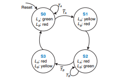

# Traffic_Light_controller

This code is an implementation of the following state transition image. Here Ta and Tb are two sensors on two roads and depending on the values, the lights La and Lb change.

